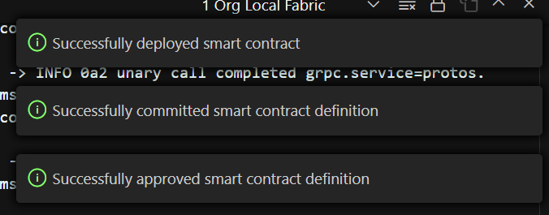
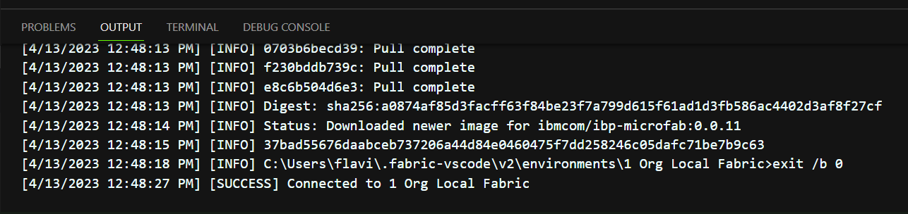
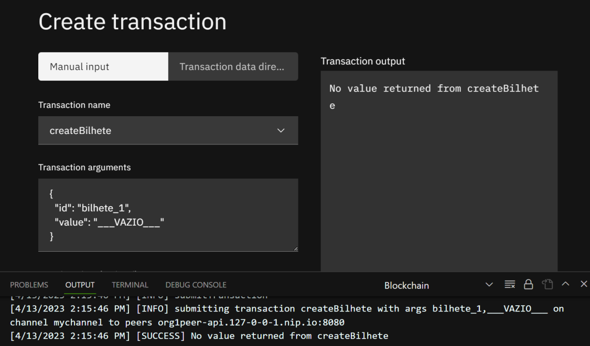
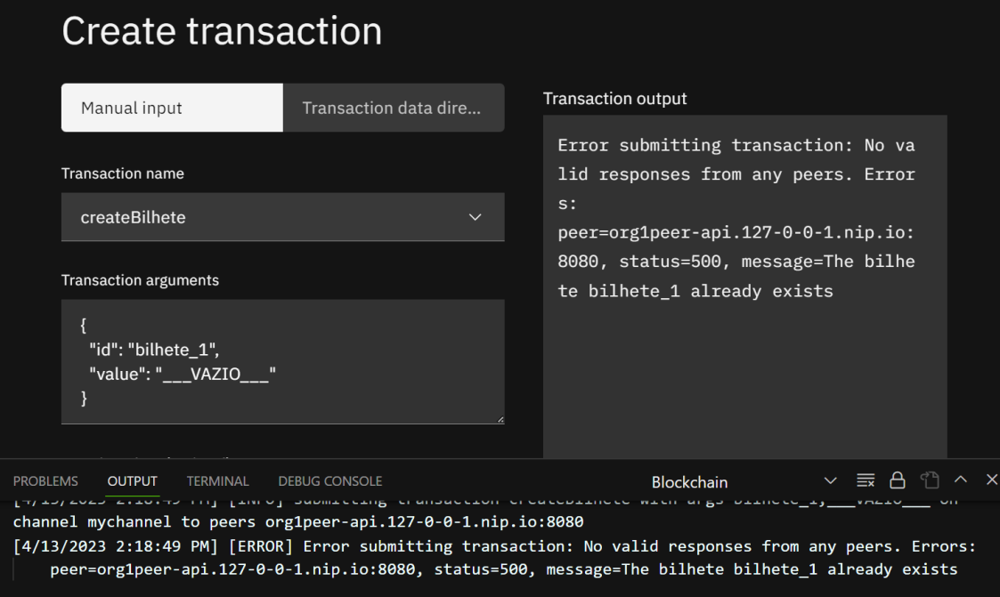
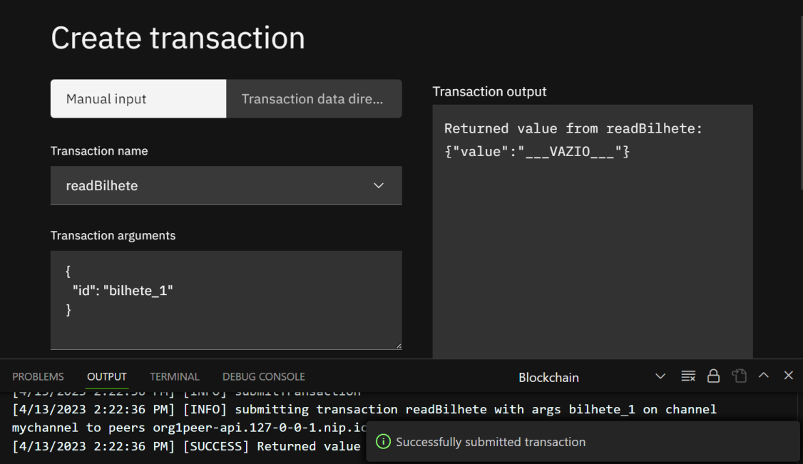
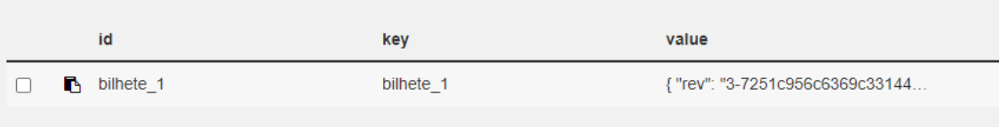
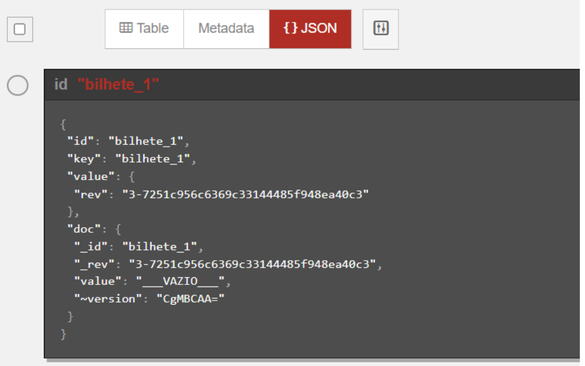
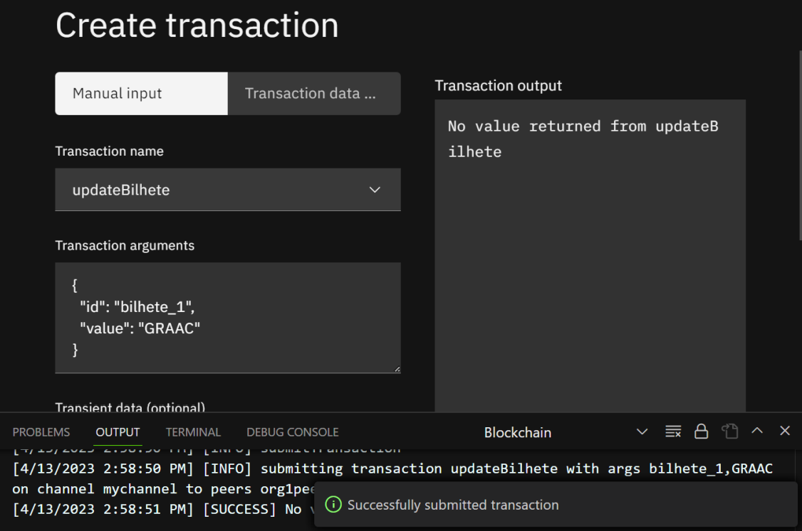
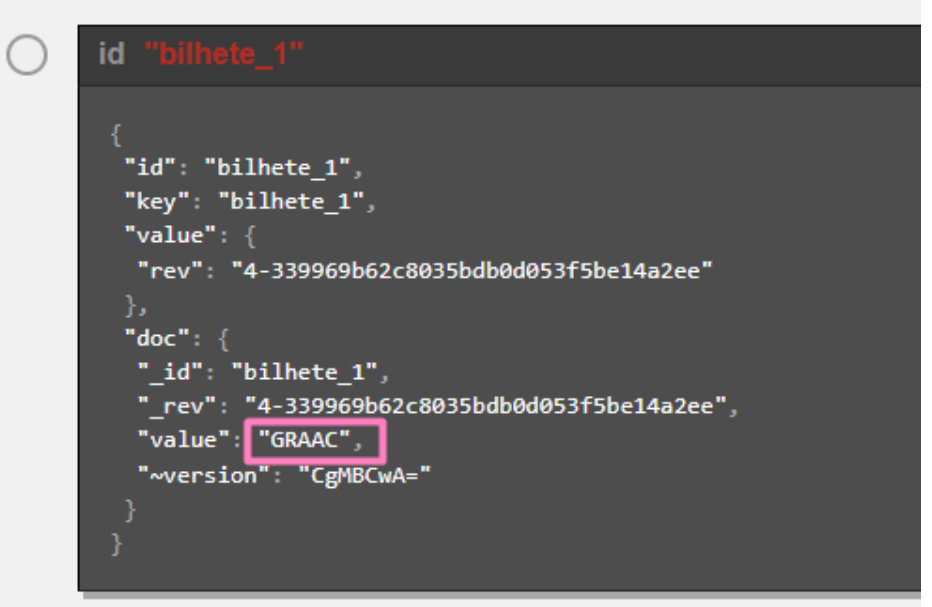
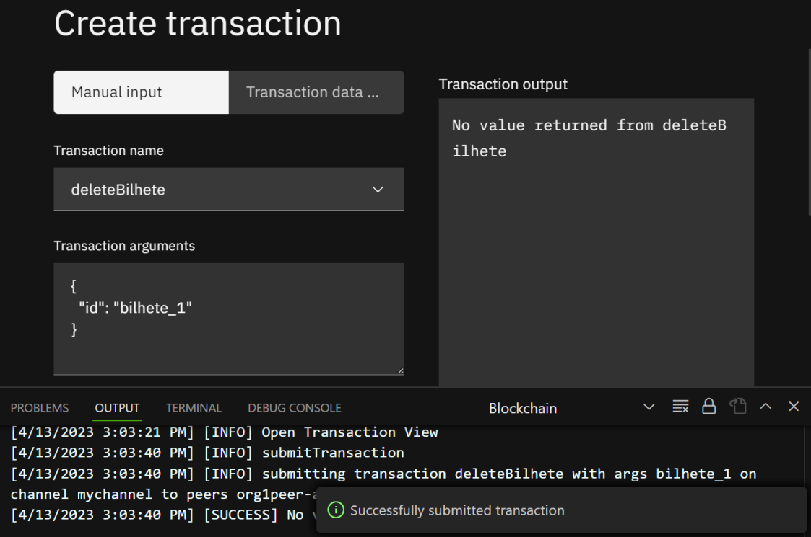

# Results 🥳
## Smart Contract Deployment:

## Creating an asset:

### Behavior when clicking Submit transaction again without changing the payload:

## Query an asset:

### Inspecting in CouchDB:

## Changing an asset:

## Deleting an asset:

